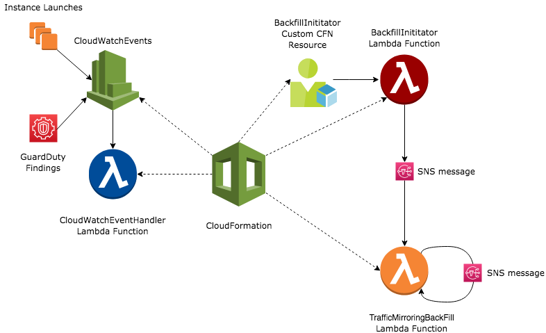

# VPC TrafficMirroring Source Automation Application
-----

### Traffic Mirroring

[Traffic Mirroring](https://docs.aws.amazon.com/vpc/latest/mirroring/what-is-traffic-mirroring.html) is an Amazon VPC feature that you can use to copy network traffic from an elastic network interface of Amazon EC2 instances. You can then send the traffic to out-of-band security and monitoring appliances for:
1. Content inspection
1. Threat monitoring
1. Troubleshooting
---
### Application Overview

The current traffic mirroring offering provides support to mirror network traffic only from elastic network interfaces attached to an EC2 instance. This serverless application allows the user to automate setting up of  traffic mirroring based on VPCs, subnets, and tags as input. This application is based on [AWS SAM](https://docs.aws.amazon.com/serverless-application-model/latest/developerguide/what-is-sam.html) framework and uses CloudFormation to set up the infrastructure. The application currently supports three use-cases:

1. Setting up traffic mirroring on existing EC2 instances
1. Setting up traffic mirroring on newly launched EC2 instances
1. Setting up traffic mirroring on EC2 instances which trigger a GuardDuty event

Each of these can be configured independently or in combinations using [parameter-overrides](https://docs.aws.amazon.com/cli/latest/reference/cloudformation/deploy/index.html) while deploying the CloudFormation stack using [AWS SAM CLI](https://docs.aws.amazon.com/serverless-application-model/latest/developerguide/serverless-getting-started.html). Based on the parameters provided during deployment, CloudFormation spins up the following infrastructure to run the application -



The infrastructure consists of 3 different lambda functions:

1. **BackfillInitiatorLambdaFunction**: This Lambda function and its associated resources are created to support the use-case for automating backfilling of existing EC2 instances based on user-defined configuration. This function is invoked at the time of stack creation with the help of a custom CFN resource and sends a SNS message to **TrafficMirroringBackfillLambdaFunction** Lambda function to initiate the backfill.
1. **TrafficMirroringBackfillLambdaFunction**: This Lambda function is responsible for describing EC2 instances in the account and matching the attributes of the EC2 instances to the user-defined configuration. If it finds a match between the VPCs, subnets or tags as provided by the user, it proceeds to set up traffic mirroring. Since a user can have 1000s of EC2 instances in their account and Lambda is limited by a specific execution timeout, this function describes a page of 200 instances at a time and then send a SNS message with the next token of the describe-instances call. This SNS message is consumed by another invocation of the same Lambda function and it continues backfilling until it has processed all the existing EC2 instances in the account.
1. **CloudWatchEventHandlerLambdaFunction**: This Lambda function is responsible for listening to [CloudWatch Events](https://docs.aws.amazon.com/AmazonCloudWatch/latest/events/WhatIsCloudWatchEvents.html) for either [GuardDuty Findings](https://docs.aws.amazon.com/guardduty/latest/ug/guardduty_findings.html) or [EC2 Instance Launch Events](https://docs.aws.amazon.com/AmazonCloudWatch/latest/events/EventTypes.html#ec2_event_type). It gets the attributes of the EC2 instances based on the events and then sets up traffic mirroring based on a match with the user-defined configuration

The general workflow of the application after it gets the attributes of an EC2 instance(existing or new instances) to setup traffic mirroring is as follows -

1. The Lambda function loads the user-defined configuration to determine if the instance involved in the event should be configured with traffic mirroring
1. The function then configures the primary ENI of the instance as a traffic mirror source
1. The Lambda function uses the Traffic Mirror target defined in the user-defined configuration to set up mirroring.
1. If a target is not defined, the Lambda function creates and reuses Traffic Mirror targets as needed. If a Traffic Mirror target has reach its source limit, the Lambda function creates a new target.
1. The function also ensures that traffic mirroring is not enabled on the target instances.

Please refer to [CloudFormation Template](https://github.com/aws-samples/amazon-vpc-traffic-mirroring-source-automation/blob/master/template.yaml) for information about resources and permissions created by CloudFormation.

------

### Setup

##### AWS SAM CLI

The application is based on AWS SAM framework. AWS SAM CLI needs to be installed to build and deploy the application with the user-defined custom configuration. The installation instructions for SAM CLI can be found [here.](https://docs.aws.amazon.com/serverless-application-model/latest/developerguide/serverless-sam-cli-install.html)

##### USER-DEFINED CONFIGURATION

The application ***requires*** a regional configuration file to specify the VPCs, subnets, and/or tags it is supposed to track along with configuration required to setup traffic mirroring. The configuration file is defined in the **config directory** and follows a naming convention of ***<REGION_NAME>.yaml*** e.g. *us-east-1.yaml*

```
amazon-vpc-traffic-mirroring-source-automation
|- traffic-mirroring
   |- config
   |  |- <REGION_NAME_1>.yaml
   |  |- <REGION_NAME_2>.yaml
   |- __init__.py
   |- app_helper.py
   |- backfill_handler.py
   |- backfill_initiator_handler.py
   |- cloudwatch_event_handler.py
   |- requirements.txt
   |- README.md
   |- template.yaml
```
Here is a sample for what a configuration file looks like:

```
tags:
- tagList:
  - Key: tagKey1
    Value: tagValue1
  - Key: tagKey2
    Value: tagValue2
  filterId: tmf-1a2b3c4d5e6f7g8h
  targetId: tmt-1a2b3c4d5e6f7g8h

subnets:
- subnetId: subnet-1a2b3c4d
  filterId: tmf-1a2b3c4d5e6f7g8h
  targetId: tmt-1a2b3c4d5e6f7g8h

vpcs:
- vpcId: vpc-1a2b3c4d
  filterId: tmf-1a2b3c4d5e6f7g8h
  targetInstanceType: t3.micro
  targetInstanceAmi: ami-1a2b3c4d5e6f7g8h
  targetSecurityGroupIds:
  - sg-1a2b3c4d5e6f7g8h
  - sg-1aaaaaaa2bbbbbbb
  targetSubnetId: subnet-5e6f7g8h
```

**YAML Keys:**
* **vpcs** (optional): List of vpc based configurations
* **subnets** (optional): List of subnet based configurations
* **tags** (optional): List of tag based configurations
* **vpcId** (required for vpcs config): Id for the vpc where instances need to be set up with Traffic Mirroring
* **subnetId** (required for subnet config): Id for the subnet where instances need to be set up with Traffic Mirroring
* **tagList** (required for tag config): List of instance tags to be tracked for instances which need to be set up with Traffic Mirroring
* **filterId** (required): Id for the Traffic Mirror Filter to be used for setting up Traffic Mirror Sessions
* **targetId** (optional): Id for the Traffic Mirror Target to be used for setting up Traffic Mirror Sessions
* **targetInstanceType** (optional): Instance type for the launch of EC2 instance whose ENI is used for setting up Traffic Mirror Targets
* **targetInstanceAmi** (optional):  Instance AMI for the launch of EC2 instance whose ENI is used for setting up Traffic Mirror Targets
* **targetSecurityGroupIds** (optional): List of security groups for the launch of EC2 instance whose ENI is used for setting up Traffic Mirror Targets
* **targetSubnetId** (optional): Subnet ID for the launch of EC2 instance whose ENI is used for setting up Traffic Mirror Targets


------
**NOTE**
* At least one of the configuration i.e. tags/subnet/vpcs need to be defined for the application to work
* You can chose to either specify an existing Traffic Mirror target(**targetId**) or you must provide properties(**targetInstanceType, targetInstanceAmi, targetSecurityGroupIds, targetSubnetId**) for creation of EC2 instances to host Traffic Mirror targets.
* The field **targetSubnetId is optional** and if undefined would create the traffic mirroring target in the same subnet as the source instance.
* There is a priority order associated with each of the configuration type. **Tagging configuration** gets evaluated before **subnet configuration** which gets evaluated before **VPC configuration**.
------

##### BUILD

* Before building the application all the necessary runtime dependencies must be installed in your run time environment.
    * Python 3.7
    * Dependencies listed in [requirements.txt](https://github.com/aws-samples/amazon-vpc-traffic-mirroring-source-automation/blob/master/traffic_mirroring/requirements.txt)

* After installing, the application can be built using the [build commands](https://docs.aws.amazon.com/serverless-application-model/latest/developerguide/serverless-sam-cli-using-build.html) in SAM CLI

------

##### DEPLOYMENT

* Follow the [deployment instruction](https://docs.aws.amazon.com/serverless-application-model/latest/developerguide/serverless-deploying.html) by SAM to deploy the application.
* By default the application would be configured to set up traffic mirroring for existing instances as well as new instance launches
* The following parameter-overrides can be applied to configure the use-cases enumerated in overview:
    * **EnableForExistingInstances**: Default is true
    * **EnableForInstanceLaunch**: Default is true
    * **EnableForGuardDuty**: Default is false

e.g  *Deploy application to set up traffic mirroring only for existing instances and GuardDuty events*:

```
sam deploy --template-file packaged.yaml --region REGION_NAME --capabilities CAPABILITY_IAM --stack-name STACK_NAME --parameter-overrides EnableForExistingInstances=true EnableForInstanceLaunch=false EnableForGuardDuty=true
```
------

##### Monitoring and Debugging

* The application generates [CloudWatch Logs](https://docs.aws.amazon.com/lambda/latest/dg/monitoring-functions-logs.html) which can be useful while debugging issues
* The user can also setup [CloudWatch Alarms](https://docs.aws.amazon.com/AmazonCloudWatch/latest/monitoring/AlarmThatSendsEmail.html) on [Lambda emitted metrics](https://docs.aws.amazon.com/lambda/latest/dg/monitoring-functions-metrics.html) to notify themselves of issues while running the app
* [CloudWatch Metric Filters](https://docs.aws.amazon.com/AmazonCloudWatch/latest/logs/MonitoringLogData.html) can be used to generate specific metrics if needed.
-------

### Limitations
* The application only supports setting up sessions for primary network interfaces of EC2 instances
* If the Lambda function fails due to an exception or a bug while processing an EC2 instance, Traffic Mirroring would not be set up. The application does log the relevant information to find out such instances

--------
### Example Scenarios

##### Scenario I

Set up traffic mirroring on existing instances as well any new instance launches with tag: *{Key=MyKey, Value=MyValue}* in us-east-1. Set up traffic mirroring with my already created NLB based target

*Configuration file: us-east-1.yaml*
```
---
tags:
- tagList:
  - Key: MyKey
    Value: MyValue
  filterId: tmf-1a2b3c4d5e6f7g8h
  targetId: tmt-1a2b3c4d5e6f7g8h
```
*Deployment command:*
```
sam deploy --template-file packaged.yaml --region REGION_NAME --capabilities CAPABILITY_IAM --stack-name STACK_NAME --parameter-overrides EnableForExistingInstances=true EnableForInstanceLaunch=true EnableForGuardDuty=false
```
##### Scenario II
Set up traffic mirroring on any instance reported by a GuardDuty finding which belongs to either vpc-1a2b3c4d or subnet-1a2b3c4d . Create traffic mirror targets on the fly for the instances matching vpc-1a2b3c4d and use my already created NLB based target for the instances matching subnet-1a2b3c4d. If an instance matches both the subnet-1a2b3c4d and the vpc-1a2b3c4d, the configuration for subnet takes a priority

*Configuration file: us-east-1.yaml*
```
subnets:
- subnetId: subnet-1a2b3c4d
  filterId: tmf-1a2b3c4d5e6f7g8h
  targetId: tmt-1a2b3c4d5e6f7g8h

vpcs:
- vpcId: vpc-1a2b3c4d
  filterId: tmf-1a2b3c4d5e6f7g8h
  targetInstanceType: t3.micro
  targetInstanceAmi: ami-1a2b3c4d5e6f7g8h
  targetSecurityGroupIds:
  - sg-1a2b3c4d5e6f7g8h
  - sg-1aaaaaaa2bbbbbbb
  targetSubnetId: subnet-5e6f7g8h
```
*Deployment command:*
```
sam deploy --template-file packaged.yaml --region REGION_NAME --capabilities CAPABILITY_IAM --stack-name STACK_NAME --parameter-overrides EnableForExistingInstances=false EnableForInstanceLaunch=false EnableForGuardDuty=true
```
-------

### License

This library is licensed under the MIT-0 License. See the [LICENSE](https://github.com/aws-samples/amazon-vpc-traffic-mirroring-source-automation/blob/master/LICENSE) file.

--------